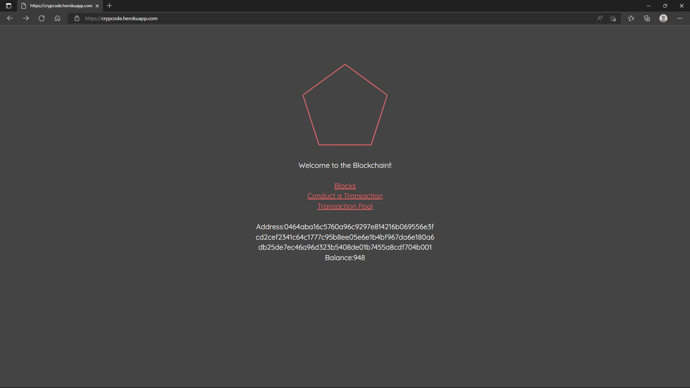
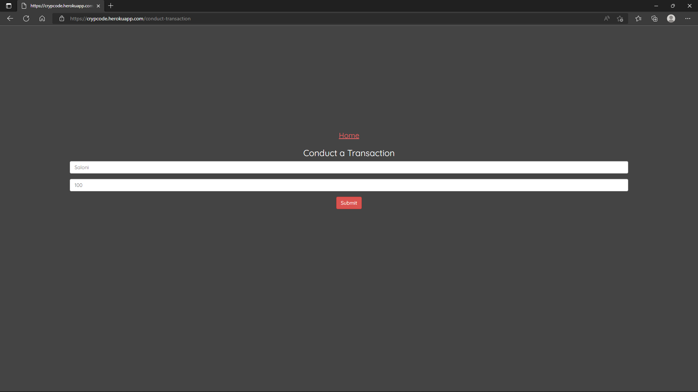
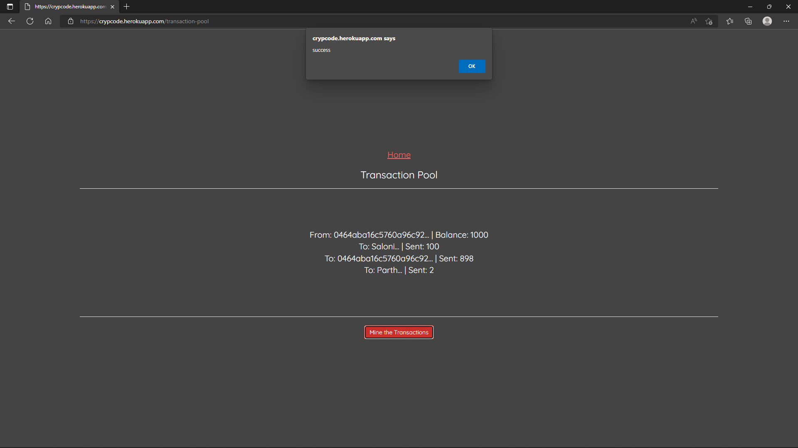
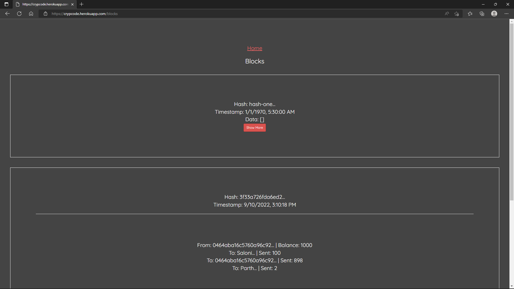

# CrypCode

Cashless transactions made secure and easy!
CrypCode is our blockchain network application that has all features and functionalities for practical use.
We have followed the approach of Test Driven Development through out the project.

## Tech Stack

**Client:** React, Parcel-bundler

**Server:** Node, Express, PubNub

## Features

- Ability to mine/create new blocks into the blockchain network.
- Enabled chain replacement to validate the blockchain.
- Implemented Proof of Work System which is the heart of any blockchain network.
- Built API to make the network user-interactive
- Implemented ability to Broadcast chains through Publisher Subscriber class(PubNub).
- Syncronisation of broadcasted chains across all peers.
- Developed the cryptographic key-pair (public & private) to create Wallet class.
- Created Transaction Pool class to enable transactions in the network.

## Run Locally

<!-- or Visit https://crypcode.herokuapp.com/ -->

Clone the project

```bash
  git clone https://github.com/ParthGadoo/CrypCode.git
```

Install dependencies

```bash
  npm install --save
```

Start the server

```bash
  npm run dev
```

## Screenshots

The Homepage displays your Public key and Balance.



Enter the Recipient name and Amount to make a transaction.



All the valid transactions that aren't mined till now are present in the transaction Pool as shown below.



Mine your transactions to add them to the blockchain network.


